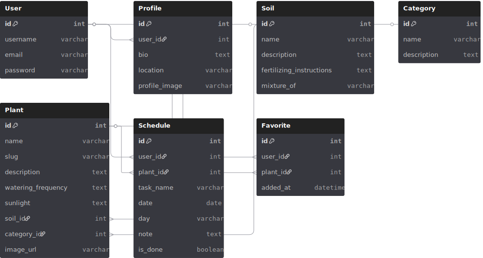

# 🌿 Plant Guide Backend

## 📖 Project Description
**Plant Guide** is a full-stack web application that helps users learn about different plants, soils, and proper care routines.  
The backend is built using **Django Rest Framework** and provides RESTful APIs for managing plant data, soil types, and watering schedules.

---

## 🛠 Tech Stack
- Python 3.13  
- Django 5  
- Django Rest Framework (DRF)  
- PostgreSQL  
- CORS Headers  
- JWT Authentication  
- Docker

---

### 🧩 Models Overview

The backend includes the following main models:

- **Plant** 🌿 – stores information about plants (name, description, watering schedule, etc.)
- **Soil** 🪴 – defines soil types and their properties
- **Category** 🌸 – classifies plants as indoor or outdoor
- **Favorite** ❤️ – connects users with their favorite plants
- **Schedule** 📅 – allows users to track watering or care tasks
- **Profile** 👤 – stores user details and photo


---

## 🧩 ERD Diagram


---

---

## 🌐 RESTful API Endpoints

| Method | Endpoint | Description |
|--------|-----------|--------------|
| **POST** | `/api/register/` | Register a new user |
| **POST** | `/api/login/` | Login and get JWT token |
| **GET** | `/api/plants/` | Get all plants |
| **GET** | `/api/plants/:id/` | Get details for a single plant |
| **POST** | `/api/plants/` | Add a new plant |
| **PUT** | `/api/plants/:id/` | Update plant details |
| **DELETE** | `/api/plants/:id/` | Delete a plant |
| **GET** | `/api/soils/` | Get all soil types |
| **GET** | `/api/categories/` | Get all plant categories |
| **GET** | `/api/favorites/` | Get user’s favorite plants |
| **POST** | `/api/favorites/` | Add a plant to favorites |
| **DELETE** | `/api/favorites/:id/` | Remove a favorite plant |
| **GET** | `/api/schedule/` | Get watering/care schedule |
| **POST** | `/api/schedule/` | Add a new schedule task |

---

### ❄️ IceBox Features
- Add notifications for watering reminders  
- Add Arabic/English translation  
- Allow users to upload their own plant photos  
- Dark mode  
- Allow users to comment on plants (user comments section)

## 🔗 Frontend Repository
👉 [Plant Guide Frontend](https://github.com/asma-alkh/plant-guide-frontend)

---

## 🧰 Installation Instructions
1. Clone the repository  
   ```bash
   git clone https://github.com/asma-alkh/plant-guide-backend.git
   cd plant-guide-backend